# Table of Contents 

1. [Our Project](#HMS)
2. [Wireframes](#WF)
3. [User Stories](#US)
4. [Entity Relationship Diagram](#ERD)
5. [Look Around](#OVW)

# E-Commerce-App 

We will create an E-Commerce web application for an electronics store that has many categories such from computers to home devices,
it has all the functionalities and customizability that you need in order to manipulate the data by adding new products or catogries and has the ability to edit them or delete them

 

[↑ Table Of Contents ↑](#TABLE)

 

 
 

## Wireframes: 

### Dashboard Page

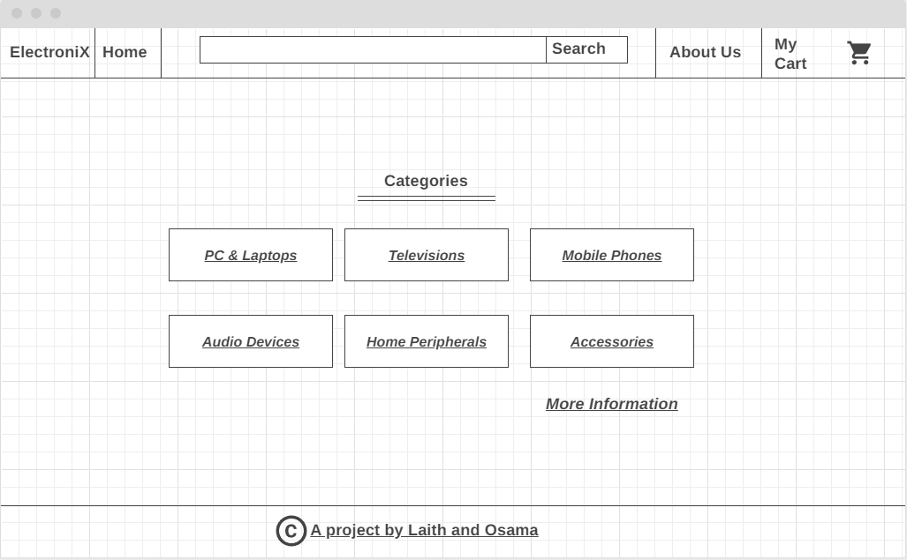

### Get All Categoties Page

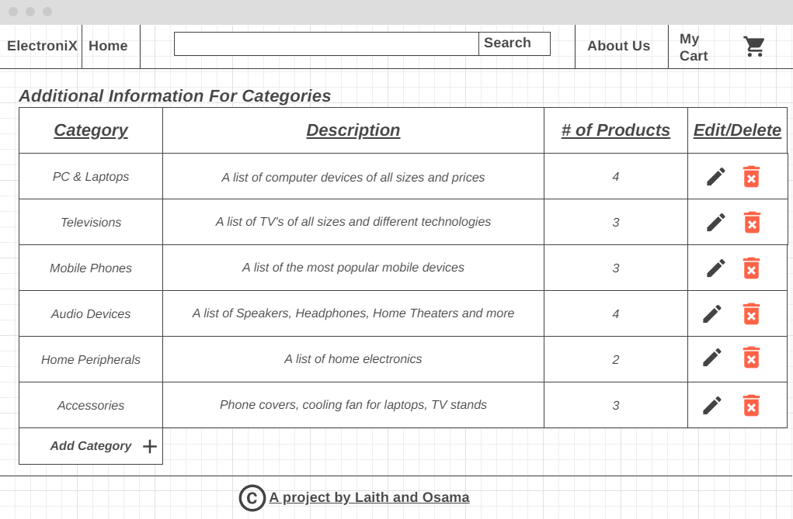

 

[↑ Table Of Contents ↑](#TABLE)

 

### Get Category Details Page

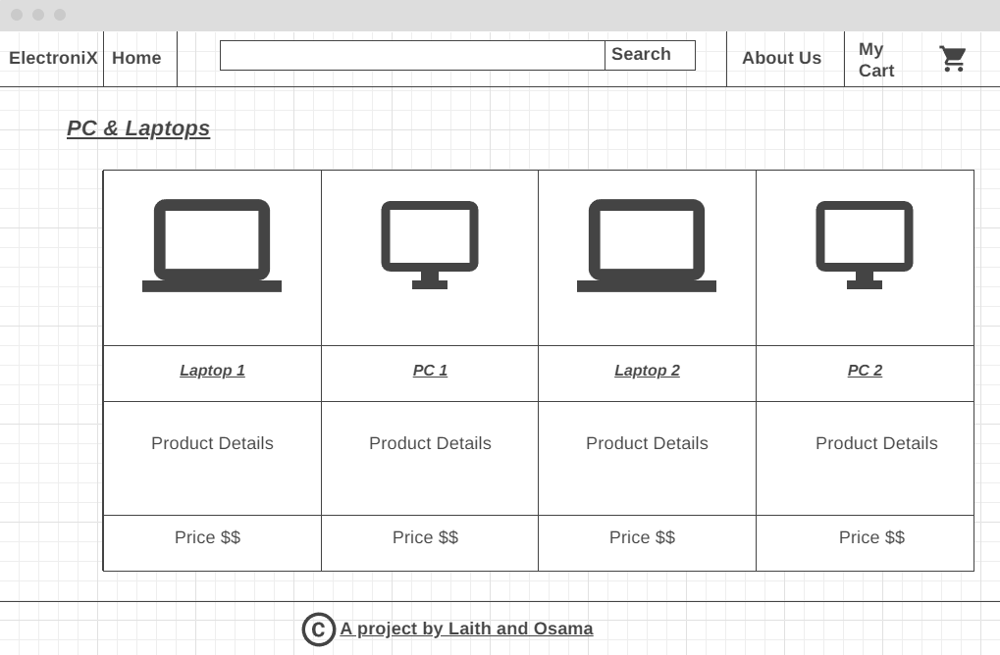

### Product Details Page

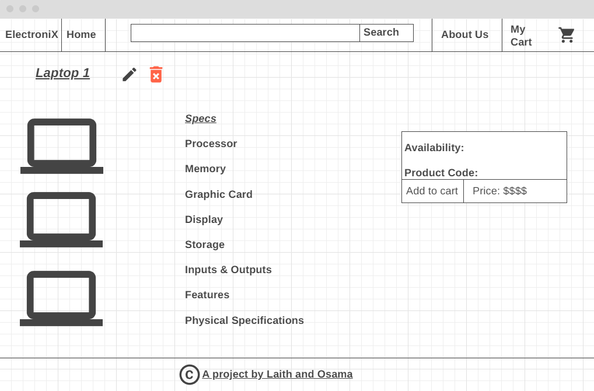

 

[↑ Table Of Contents ↑](#TABLE)

 

 
 

## User Stories:

1. As an administrator user, I would like to have a dashboard where I can see a list of product categories
2. As an administrator I would like add and save a new product so that I can expand my inventory
3. As an administrator I would like add and save a new category so that I can expand my product lines
4. As an administrator I would like to associate a product to a category so that my users can more easily browse our inventory
5. As an administrator I would like to be able to delete products and categories as needed
6. As an editor user, I would like to view a detail page for each category so that I can eventually edit its data or delete it
7. As an editor user, I would like a detail page for each product so that I can eventually edit its data
8. As an editor I would like to be able to edit/modify categories so that I can change my storefront structure in real time
9. As an editor I would like to be able to edit/modify products so that I can change my inventory in real time
10. As a user, I would like to see a list of the products assigned to a category on the category details page
11. as a user, I would like to view a details page for each product.
12. as a user, I would like to have the ability to SignIn/SignOut of the website
13. as a user, I would like to add a product to my cart for future purchase
14. as a user, I would like to view a reciept of my order before purchasing
15. as a user, I would like to recieve the reciept for my order on my email once purchased

 

[↑ Table Of Contents ↑](#TABLE)

 

 
 

## Entity Relationship Diagram 

Full diagram that shows the whole relationships between entities & their nature (one-many, many-many).

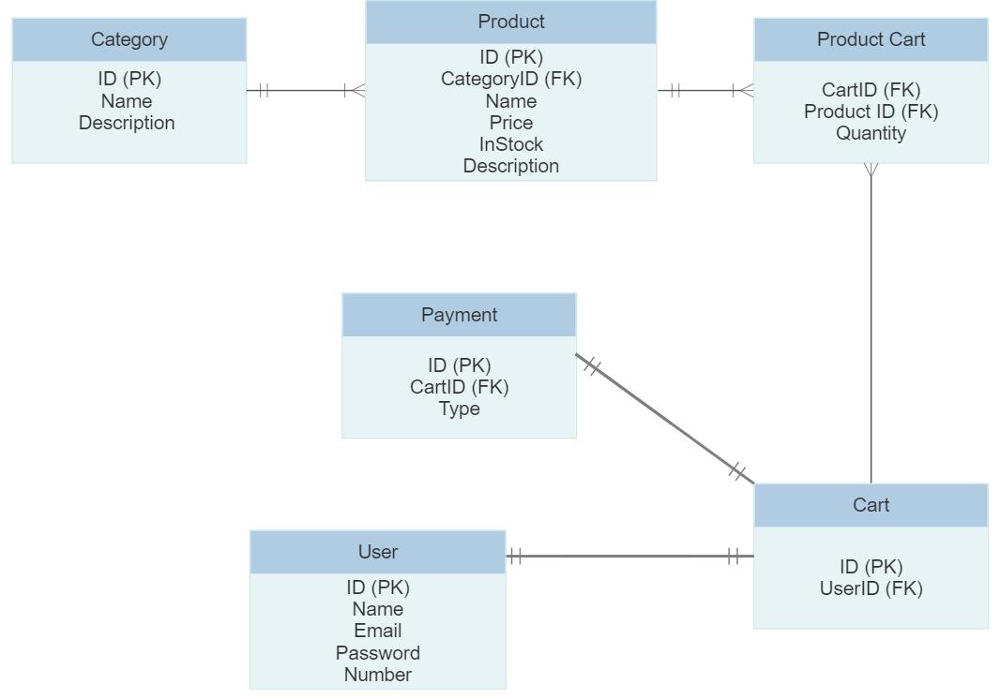

[↑ Table Of Contents ↑](#TABLE)

## Look Around 

Here we can see an overview of the website

***Landing Page***
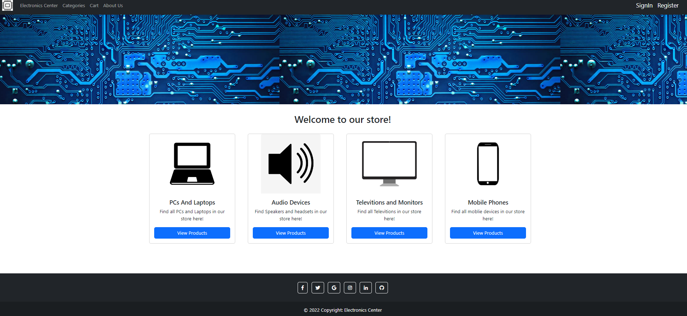

***SignUp Page***
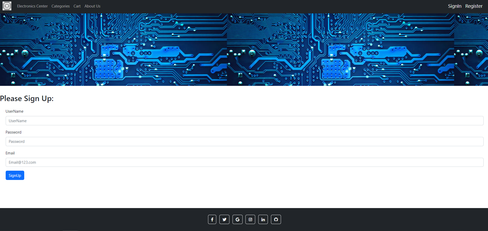

***SingIn Page***

***SignIn Bavigation Bar***

Here we can see how the navigation bar changes upon logging in to the website

***Product List Page***
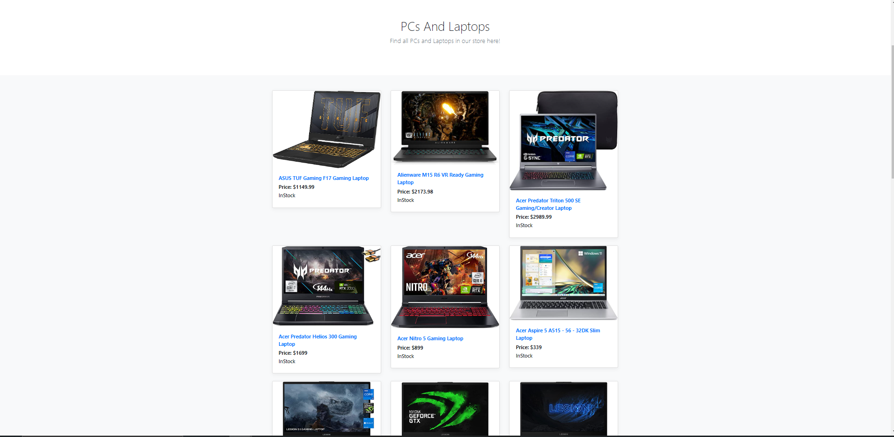

***MiniCart***
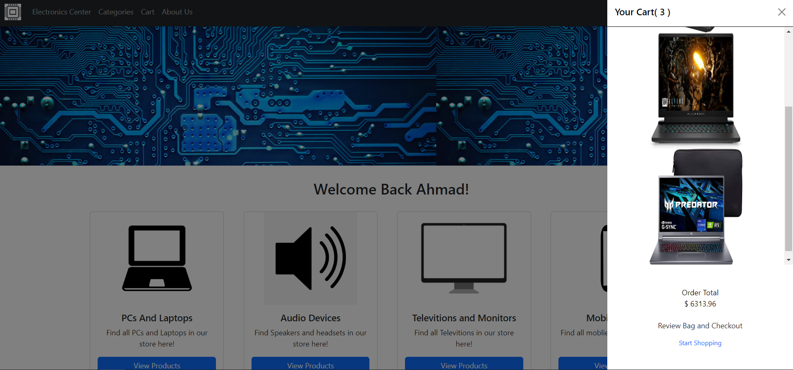

***Cart Page***
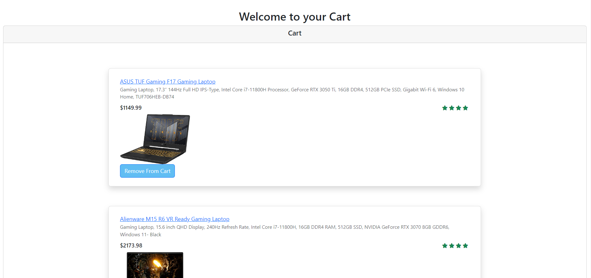

***Reciept Page***
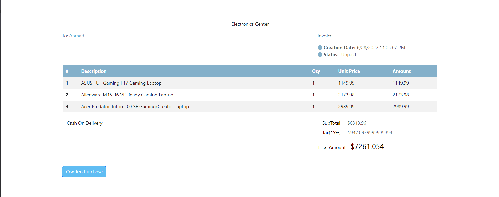
